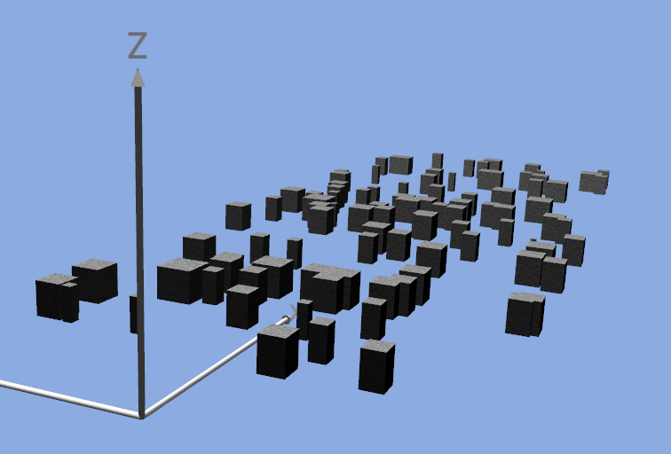
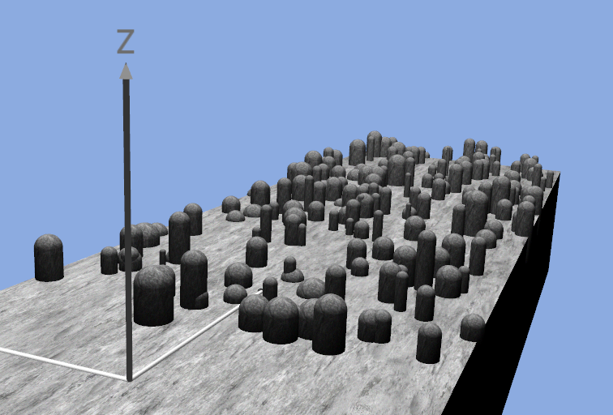
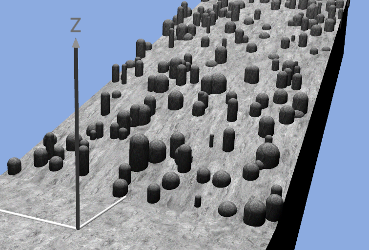
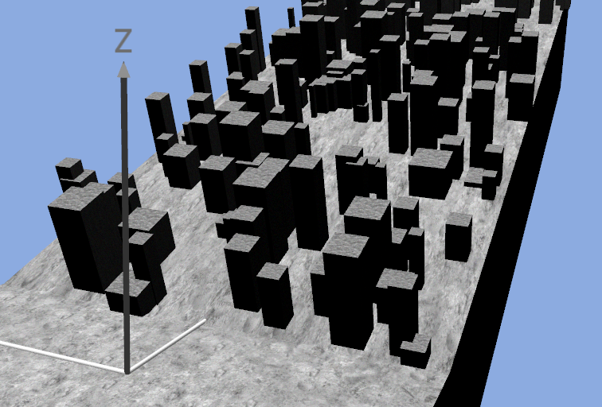
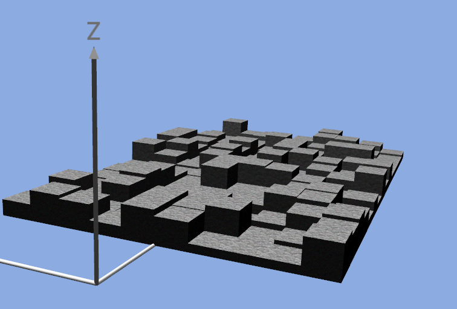
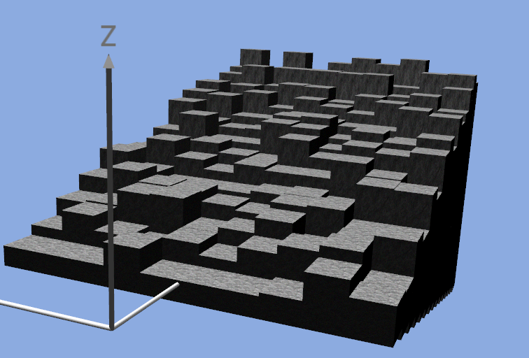
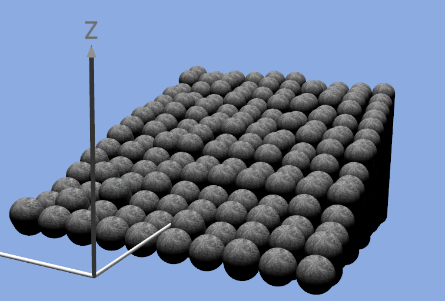

Plugins: Obstacle Generator {#plugin_obstacle_generator}
===========

## Overview

The obstacle\_generator plugin allows to create configurable fields of obstacles in MARS. The obstacles come in shapes of either round pillars with semi-spherical tops (in other words: half-capsules) or as cuboids and can be arranged in regular or random fashion flat surfaces of variable inclination.

## Obstacles

Obstacles are defined by their type and size, the type being either cuboid or semi-capsule, governed by the parameter *use_boxes*, which will result in cuboid obstacles if set to *true*. The obstacle types cannot be mixed - all generated obstacles have the same type. The size of the obstacles is determined by a number of parameters:

- min_obstacle_width
- mean_obstacle_width
- max_obstacle_width
- std_obstacle_width
- mean_obstacle_length
- min_obstacle_height
- mean_obstacle_height
- max_obstacle_height
- std_obstacle_height

The actual size of an individual obstacle in random mode is decided by drawing from normal distributions defined by the listed parameters (and restricted by the specified min and max values), with length following the min, max and std of width. This however only makes a difference for boxes, as capsuled by definition have a circular cross-section. The parameter *obstacle_number* defines the number of obstacles to be scattered on the designated area, which is defined by *field_width*, *field_length* and *field_distance*, the latter being an offset of the field in direction of the x-axis. Consequently, *width* refers to the obstacles' dimension along the y-axis, *length* along the x-Axis and *height* along the z-Axis.

If instead of the random scatter the grid mode is used, the parameters are interpreted differently. *field_width* and *field_length* now specify the number of obstacles along the y- and x-axis, while *mean_obstacle_width* and *mean_obstacle_length* define the size of a grid cell, with all cells being of equal size. Height values are still sampled from a restricted normal distribution. The number of obstacles is in this mode calculated and not read.

## Support platform

It is possible, setting the option *support_platform* to true, to create ground surfaces for the obstacles fields. This is useful in random scatter mode to have a (flat or inclined) surface on which the obstacles are scattered if the scene used in simulation does not already contain any ground structures. Even in grid mode, where there are (at least using cuboids) no gaps between the obstacles, the support platform extends from the origin to the border of the obstacle field.

## Inclined surfaces

The surface on which the obstacles are scattered or arranged can be inclined by any arbitrary angle, although the plugin has only been tested for angles between -90° and +90°. If a support platform is created, it is inclined as well (apart from the section between origin and obstacle field border, which is always horizontal). If an *incline_angle* is specified, the option *incline_obstacles* can be used to turn the obstacles with the inclination such that their height axis stays orthogonal to the inclined surface.

## Visuals

The six parameters *ground\** and *obstacle\** define the textures, bump maps and normal maps used for the objects.

## Examples

\[22.09.2014\]

